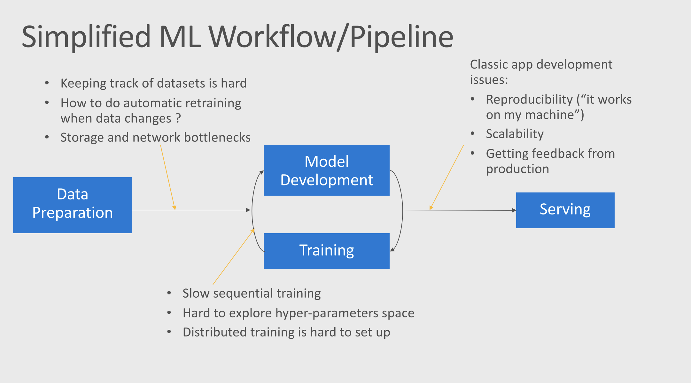
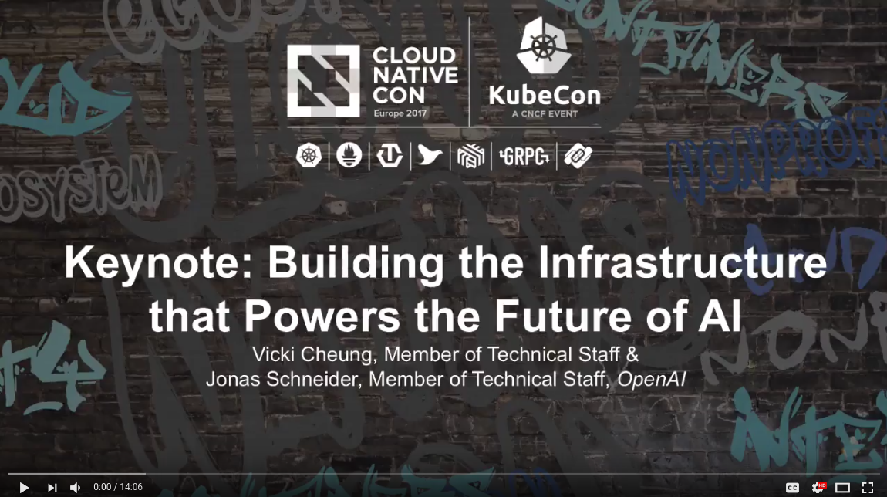

# Introduction and Setting Up

## Motivations

Machine learning model development and operationalization currently has very few industry-wide best practices to help us reduce the time to market and optimize the different steps.

However in traditional application development, DevOps practices are becoming ubiquitous. 
We can benefit from many of these practices by applying them to model developement and operationalization.

Here are a subset of pain points that exists in a typical ML workflow.
#### A Typical (Simplified) ML Workflow and its Pain Points

This workshop is going to focus on improving the training process by leveraging  containers and Kubernetes.

Today many data scientists are training their models either on their physical workstation (be it a laptop or a desktop with multiple GPUs) or using a VM (sometime, but rarely, a couple of them) in the cloud.

This approach is sub-optimal for many reasons, among which:
* Training is slow and sequential
  * Having a single (or few) GPU on hand, means there is only so much trainings you can do at the time. It also means that once your GPU is busy with a training you cannot use it to do something else, just as smaller experiments.
  * Hyper-parameter sweeping is vastly inefficient: The different hypothesis you want to test will run sequentially and not in parallel. In practices this means that very often we don't have time to really explore the hyper-parameter space and we just run a couple of experiments that we think will yield the best result.
  The longer the training time, the fewer experiments we can run.
* Distributed training is hard (or impossible) to setup
  * In practice very few data scientist benefit from distributed training. Either because they simply can't use it (you need multiple machines for that), or because it is too tedious to setup.
* High cost
  * If each member of the team has it's own allocated resources, in practices it means many of them will not be used at any given time, given the price of a single GPU, this is very costly. On the other hand pooling resourcing (such as sharing VM) is also painful since multiple people might want to use them at the same time.

Using Kubernetes, we can alleviate many of these pain points:
* Training is massively parallelizable
  * Kubernetes is highly scalable (up to 1200 VMs for a single cluster on Azure). In practice that means you could run as many experiments as you want at the same time. This makes exploring and comparing different hypothesis much simpler and efficient.
* Distributed training is much simpler
  * As we will see in this workshop, it is very easy to setup a TensorFlow distributed training on kubernetes, and scale it to whatever size you want, making much more usable in practice.
* Optimized cost with autoscaling* 
  * Kubernetes allows for resource pooling while at the same time ensuring that any training job can run without waiting for another one to finish.
  * With autoscaling the cluster can automatically scale out or in to ensure maximum utilization, thus keeping the cost as low as possible.

*While autoscaling is very powerful, it is outside the scope of this workshop. However we will give you resources and pointer to get started with it.

## OpenAI: Building the Infrastructure that Powers the Future of AI 

During KubeCon 2017, Vicki Cheung and Jonas Schneider delivered a keynote explaining how OpenAI manage to handle training at very large scale with Kubernetes, it is worth listening to: 

## Next Step
[Module 1: Docker](../1-docker/README.md)
