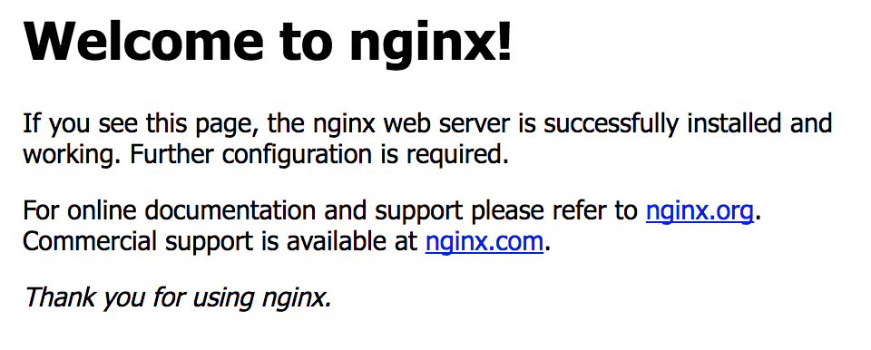

# Docker

### Summary

In this section you will learn about :
* Running Docker locally
* Basics of Docker
* Containerizing a simple application
* Building and Pushing a Image

### Setup Docker locally

The official documentation from *docs.docker.com* is very well detailed for setting up Docker locally depending your OS :
* [Mac](https://docs.docker.com/docker-for-mac/)
* [Linux](https://docs.docker.com/engine/installation/linux/) 
* [Windows](https://docs.docker.com/docker-for-windows/)

### Basics of Docker

You can see all the commands running `docker --help` from your terminal or powershell.

#### Base image and registry

All containers contains **layers**. Those layers are customizations such as tools installations, scripts and more. 

In a really high level example, if you want an ubuntu image with python3 installed and the Azure CLI, you have to think about the following steps :
- Install ubuntu
- Install python3 from apt-get
- Install Azure CLI from a script

With Docker, those 3 steps are considered as layers. Those layers can already be prebuilt, to avoid all the installation time, and called **base image**.

Those **base images** can be built and used locally, or pulled from a **registry**. This **registry** could be either public or private. One of the most popular one and official at Docker is called : [Docker Hub](https://hub.docker.com/)

If you look at the [Docker Hub](https://hub.docker.com/) and do some search you can find a multiple of **official images** such as : Ubuntu, Redis, Nginx, Mongo and more...

> You can also search from your terminal using the `docker search` command line.

We will explain later how build locally you own image.

# NOTE : ADD a section to explain the usage of docker apply to ML.

#### Command line

We will describe the most important command to start with in this section.

1. `docker run OPTIONS IMAGE COMMAND`
    
    The docker `run` command allow to start a container, with different options, from a base image.

    Popular OPTIONS :

    |Option|Description|Scenario|
    |-|-|-|
    |-it|Interactive mode (-i and -t combined)|When you need a prompt in the container
    |-d|Detached|When you want to run you container in the background such as scripts or server.
    |-P|Map the necessary port in the container to the host using random one|When you want to reach a port in your container, for example the port 80 for a web server
    |-p|Map some specific port in the container to specific host one |When you want to reach a port in your container, for example the port 80 for a web server
    |-e|Inject a environment variable|When you are using environement variables in your script such as connection string
    |-v|Mount a folder from the host in the container|When you want to modify files in your container such as configuration or codes for example, without to restart a new one
    |--name|Give a name to the container|When you want to identify your containers
    |--rm|Automatically delete the process at then end of the execution|When you are creating / removing all the time your containers

    > Those options can be combined

    IMAGE : Base image that you want to use. An image also have a concept of `tags`, we will explain it later.

    COMMAND (Optional) : Command to run inside your container

    Examples

    |Command|Description|
    |-|-|
    |`docker run -it --rm --name myUbuntuContainer ubuntu /bin/bash`|Run an official Ubuntu image in an interactive mode with the bash|
    |`docker run -d --rm --name SimpleWebServer nginx`|Run an official Nginx image in a detached mode named SimpleWebServer|
    |`docker run -d --rm -P nginx`|Run an official Nginx image in a detached mode and mapped open ports necessary to my host environement|
    |`docker run -d --rm -p 8080:80 nginx`|Run an official Nginx image in a detached mode and mapped the port 8080 from my host to the port 80 in the container|
    |`docker run  -v pwd:pwd -it ubuntu ls`|The -v flag mounts the current working directory into the container and will list the contains of it|
        

1. `docker ps`

    The docker `ps` command allow to list the status of the containers.

    A container could be either stopped or running. When it finish to execute the process asked it will stop. 
    
    For example if you run the command `docker run -it ubuntu hostname` this will :
    - Pull the official ubuntu image from the registry
    - Start the container in the interactive mode `-it`
    - Execute the command : `hostname`
    - Stop

    ```
    $ docker run -it ubuntu hostname
    0d0af5005fc7
    ```

    If you run the command `docker ps -a` you should see :
    ```
     $ docker ps -a
    CONTAINER ID        IMAGE               COMMAND             CREATED             STATUS                          PORTS               NAMES
    0d0af5005fc7        ubuntu              "hostname"          58 seconds ago      Exited (0) About a minute ago                       gifted_darwin
    ```

    > The `-a` allow you to list all the containers not only the running one

    We can notice few things here such as :
    - The status `Exited...` for our container
    - The name `gifted_darwin` randomly generated for our container, we can specify a custom one using the command `--name` explained in the previous section.
    - We can re execute our container using the command `docker start gifted_darwin`
    - We can run again the same command `docker run -it ubuntu hostname` and do a `docker ps -a`, we should see mow two containers exited.

1. `docker logs`

    The docker `logs` allow to fetch the console output from inside the container

    From our previous example, we can run `docker logs gifted_darwin`

    ```
    $ docker logs gifted_darwin
    0d0af5005fc7
    ```

    You can also stream the logs using the command `-f` and print in real time in your console the stdout of your container.

1. `docker rm`

    The docker `rm` command allow to remove a container.

    From the previous example, we can see that we have a container listed as exited in our environement, or maybe more if we run the same command `docker run -it ubuntu hostname` multiple time. If we want to do some clean and remove those executions from our environement we can use the command `docker rm`

    ```
    $ docker rm gifted_darwin
    gifted_darwin
    ```

    > You can either specify the **CONTAINER ID** or the **NAME** of the container to refer it


1. `docker images`

    This command allow us to list all the base images available in your environement.

    ```
    $ docker images
    REPOSITORY                                      TAG                 IMAGE ID            CREATED             SIZE
    ubuntu                                          latest              20c44cd7596f        2 days ago          123MB
    example-scratch                                 latest              32ff7b65f567        5 days ago          30.7MB
    node                                            8.9.1-slim          a6bb2cc1118f        11 days ago         230MB
    buildpack-deps                                  xenial              a27b6a8abd1c        2 weeks ago         644MB
    ```

    > You can manage your images by removing them using `docker rmi IMAGENAME` or pulling new one with `docker pull IMAGENAME`

#### Containerizing a simple application

Now that we understand the basics of Docker, we will apply it to a concrete example by running and containerizing a simple application.

In this example we will write a basic python web application, using the [Flask framework](http://flask.pocoo.org/), so we will need to make sure that we have the python libraries installed. We will also use a ubuntu base image simce it is a simple linux distribution to understand.

Like in the previous section, we will automated the following steps :
- Use Ubuntu as base image
- Install the python package manager pip
- Copy our custom code
- Execute it when we launch our container

We will introduce the concept of Dockerfile.

A Dockerfile is a simple definition file of the layers that we need to run our application in a container.

This use some specific keywords, you can find more information [in the official documentation](https://docs.docker.com/engine/reference/builder/), we will describe the most used one in the following section :

1. `FROM`

    `FROM` is the first keyword prerequisite to define the base image that we will use to start from.

1. `WORKDIR`

    The `WORKDIR` instruction sets the working directory for any `RUN`, `CMD`, `ENTRYPOINT`, `COPY` and `ADD` instructions that follow it in the Dockerfile. If the `WORKDIR` doesn’t exist, it will be created even if it’s not used in any subsequent Dockerfile instruction.

1. `RUN`

    The `RUN` instruction will execute any commands in a new layer on top of the current image and commit the results. The resulting committed image will be used for the next step in the Dockerfile.

    You can run multiple commands in the same line to avoid multiple layers for optimizations.

1. `ADD`

    The ADD instruction copies new files, directories or remote file URLs from <src> and adds them to the filesystem of the image at the path <dest>

1. `EXPOSE`

    The `EXPOSE` instruction informs Docker that the container listens on the specified network ports at runtime. You can specify whether the port listens on TCP or UDP, and the default is TCP if the protocol is not specified.

1. `ENV`

    The `ENV` instruction sets the environment variable <key> to the value <value>.

1. `ENTRYPOINT`

    An `ENTRYPOINT` allows you to configure a container that will run as an executable.

#### Dockerfile applied to our example :

Let's pretend you are developing locally our Flask application. We have a repository named `src` with a file named `app.py` with the following code :

```python
from flask import Flask
app = Flask(__name__)

@app.route('/')
def hello_world():
    return 'Hello, World!'
```

We are creating a file named Dockerfile a the root of our repository.

With the previous concepts applied to our example, this file should looks like :

```Dockerfile
# Base image to start from. We are specifying the version that we want (16.04) using a tag
FROM ubuntu:16.04
# Working directory where to run all the next commands
WORKDIR app
# Commands to exectute in the image, installation of pip and the flask package from pip
RUN apt-get update && apt-get -y upgrade && apt-get install -y python3-pip
RUN pip3 install Flask
# Copy the local folder named src into the container (Inside the workdir)
COPY src .
# Expose the default Flask port
EXPOSE 5000
# Set environements variable with default values, needed for Flask 
ENV LC_ALL C.UTF-8
ENV LANG C.UTF-8
ENV FLASK_APP app.py
# Default command to execute at the launch
CMD ["flask", "run", "--host=0.0.0.0"]
```

We have now the following structure :

```
.
├── src
|   ├── app.py
├── Dockerfile
```

#### Build an Image

The next step is to build our image to be able to run it using docker. For that we will use the command `docker build`.

You can find the [official documentation](https://docs.docker.com/engine/reference/commandline/build/) on the official website.

From our application repository, we can run the command : `docker build -t mypythonapp .`

> The `-t` command allow to **tag** the image with a specific custom name.

You should the build process inside your terminal who will run the commands one by one

```
...
Step 7/8 : ENV MyVAlue Hello MLADS !
 ---> Running in f7d115bdfce4
 ---> 0cd4ff7ad04b
Removing intermediate container f7d115bdfce4
Step 8/8 : ENTRYPOINT python3 app.py
 ---> Running in 8f8da115cfed
 ---> 5963706e6232
Removing intermediate container 8f8da115cfed
Successfully built 5963706e6232
Successfully tagged mypythonapp:latest
```

When you have the successfully built message, you should be able now to see if your image is locally available with the command `docker images` described earlier.

Now we can try to run it locally using the `docker run` command :

```bash
$ docker run -it -d -P mypythonapp
2cd43118545d23d361e0892abe94cb9c06ad25a449b07e7ab9a8b3bcbfa3f472
```

> As reminder this command will run the docker image named `mypythonapp` in a detached mode and exposing the port necessary described in the dockerfile.
> The terminal is answering with the name id of the container : `2cd43...`

You should be able to see if your container is correctly running with the `docker ps` command.

```bash
$ docker ps
CONTAINER ID        IMAGE               COMMAND                  CREATED              STATUS              PORTS                     NAMES
2cd43118545d        mypythonapp         "flask run --host=..."   About a minute ago   Up About a minute   0.0.0.0:32773->5000/tcp   awesome_fermi
```
As we can see the status fo the container is **UP** and using the port 32773 on the host to redirect to the port 5000 in the container.

We can now open a browser on the page [http://localhost:32773](http://localhost:32773) to see our application running.

The next step is to publish this image to a repository to be able to pull it from anywhere.

#### Publish an Image

Our image is now built and run it locally, but what about to share it to use it from anywhere by everybody ?

We already introduced the concept of repository, we will now talk about the `push` action.

Using the command `docker push` we will able to publish our image to a repository.

For this example, we will use the [Docker Hub](https://hub.docker.com/) public repository. You need to be register to use it.

When you are able to be connected on your [Docker Hub](https://hub.docker.com/) page you can run locally the command `docker login` using the same credentials.

```bash
$ docker login
Login with your Docker ID to push and pull images from Docker Hub. If you don't have a Docker ID, head over to https://hub.docker.com to create one.
Username : wbuchwalter
Password: *************
Login Succeeded
```

The next step will be to tag your image correctly before to publish it using the `docker tag` command. 

The image should have the following structure name `<DockerHUBUserName>\<ImageName>:<Tag>`. In our case we will name our image with following structure : `wbuchwalter\mypythonapp`

```bash
$ docker tag mypythonapp wbuchwalter/mypythonapp
```

You can verify it running the `docker images` command 

```bash
$ docker images
REPOSITORY                                      TAG                 IMAGE ID            CREATED             SIZE
wbuchwalter/mypythonapp                     latest              78344eed0d30        20 hours ago        451MB
mypythonapp                                     latest              78344eed0d30        20 hours ago        451MB
ubuntu                                          16.04               20c44cd7596f        3 days ago          123MB
ubuntu                                          latest              20c44cd7596f        3 days ago          123MB

```

We are now ready to push our image.

```bash
docker push wbuchwalter/mypythonapp
```

### Exercices

### 1. Run a local docker image

In this first exercice you will pull and run an official `nginx` image on your local docker environenement.

#### Validation

Since `nginx` is a web server, you will need to expose the port 80. You should be able to see following webpage from your browser :




#### Solution

<details>
<summary><strong>Solution (expand to see)</strong></summary>
<p>

```bash
# All solutions accepted
docker run -it -P nginx
docker run -it -p 80:80 nginx
docker run -it --rm -p 80:80 nginx
docker run -it -d --rm -p 80:80 nginx
...
```

</p>
</details>

### 1. Build and push your own image to a repository

In this second exercice you will have to create your own image and push it to [Docker Hub](https://hub.docker.com).

#### Validation

- This image have to print a custom message in the console such as : `Hello <YourName>`
- This message will call an environement variable name NAME_MESSAGE
- We will able to modify this variable to customize the message with our own name. For example : `Hello Julien`
- If this variable is not set when we start to container it will take the value : `World`. This will print the message `Hello World`
- Don't think to complicated, use `bash` to create you script.

#### Solution

<details>
<summary><strong>Solution (expand to see)</strong></summary>
<p>

We are creating a file named `app.sh` which contain:
```bash
#!/bin/bash
while true; do
    echo Hello $NAME_MESSAGE
    sleep 1
done
```

Dockerfile :

```Dockerfile
FROM ubuntu
ENV NANE_MESSAGE World
WORKDIR src
ADD app.sh .
CMD ["sh","app.sh"]
...
```

Docker command to build, run and publish :
```bash
# Build the image
docker build -t wbuchwalter/myawesomecontainer .
# Execute it locally
docker run -it -e NANE_MESSAGE=Will wbuchwalter/myawesomecontainer
# Push to Docker Hub
docker push wbuchwalter/myawesomecontainer
```

</p>
</details>


### Useful Links
* [What is Docker ?](https://www.docker.com/what-docker)
* [Docker for Mac](https://store.docker.com/editions/community/docker-ce-desktop-mac)
* [Docker for Windows](https://store.docker.com/editions/community/docker-ce-desktop-windows)
* [Docker for Ubuntu](https://store.docker.com/editions/community/docker-ce-server-ubuntu)
* [Docker for beginner](https://github.com/docker/labs/blob/master/beginner/readme.md)

### Expected Result

Doing a `kubectl describe pod <pod-name>` should show...