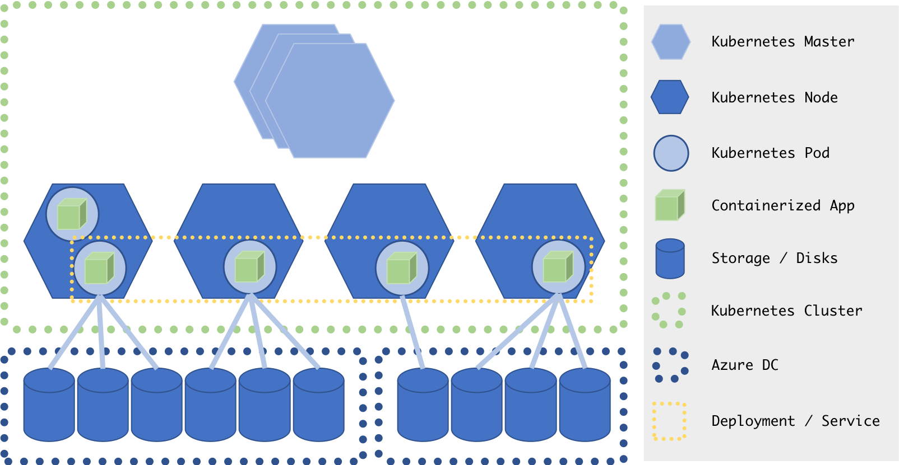

# Going Further

## Summary

* Learn how to deal with very large amount of input data
* Learn how to autoscale a kubernetes cluster on acs-engine.

## Working with large amount of data

In the previous modules, we saw how we could easily scale our trainings on Kubernetes to a large amount of nodes.
We also saw how Azure Files provides an easy way to add persistent storage to our trainings to save the output models, summaries etc.

However in every example we worked with so far, the training data was either downloaded at run time, or directly baked into the container. While this can work for very small datasets, it is not a scalable approach for larger ones.
Just as we used Azure Files to store models and logs, we can use Azure Files to store our dataset and mount the share in our containers. This work well only up to a certain point though (say a few GBs), as an Azure file share is limited to 1000 IOPS.

So how can we deal with larger datasets?
One solution to this is to use a distributed file system.

### Distributed File System, Tools and Concepts

A distributed file system aggregates various storages over network into a single large network file system.
Such a file system can be deployed inside your Kubernetes cluster, and can use the disks already attached to your nodes as a partition of the overall network file system.

Here are some tools and frameworks that can make it easy to deploy such a distributed file system on Kubernetes:

* [GlusterFS](http://www.gluster.org/)
* [Rook](https://rook.io/)
* [Portworx](https://portworx.com/)
* [Pachyderm](http://pachyderm.io/)

## Autoscaling a Kubernetes Cluster

As we saw in module [7 - Distributed TensorFlow](../7-distributed-tensorflow/) and [8 - Hyperparameters Sweep](../8-hyperparam-sweep), being able to autoscale our Kubernetes cluster can be extremely useful.
Indeed, automatic scale-out (adding more VMs to the cluster) would allow anyone to run any experiment they want, whenever they want without needing to involve an ops person to setup and prepare virtual machines.
And because the cluster can also automatically scale-in by deleting idle VMs once training jobs are completed, we can keep the cost as low as possible by just paying for what we actually use.

As of this writing, autoscaling is only supported on Kubernetes cluster created with [acs-engine](https://github.com/Azure/acs-engine).

See the following resources to get started:

* [Kubernetes Azure cluster-autoscaler](https://github.com/kubernetes/autoscaler/tree/master/cluster-autoscaler/cloudprovider/azure)
