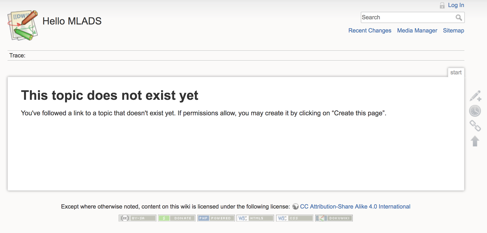

# Helm

## Prerequisites

* [Docker Basics](../1-docker/README.md)
* [Kubernetes Basics and cluster created](../2-kubernetes)

## Summary

In this module you will learn :
* What is Helm and to use it
* What is a Chart and how to create one
  
## Context

As you saw in the second module [Kubernetes Basics and cluster created](../2-kubernetes) the default way to deploy objects in Kubernetes is by using `yaml` files.

For example, if you we want to deploy a `pod` running `nginx` and then make it available from a external IP using a `service` you will need to describe at least those two objects such as :

Deployment : 
```yaml
apiVersion: apps/v1beta2 # for versions before 1.8.0 use apps/v1beta1
kind: Deployment
metadata:
  name: nginx-deployment
spec:
  selector:
    matchLabels:
      app: nginx
  replicas: 2 # tells deployment to run 2 pods matching the template
  template: # create pods using pod definition in this template
    metadata:
      labels:
        app: nginx
    spec:
      containers:
      - name: nginx
        image: nginx:1.7.9
        ports:
        - containerPort: 80
```
Service :
```yaml
apiVersion: v1
kind: Service
metadata:
  name: nginx-service
spec:
  ports:
  - port: 8000 
    targetPort: 80
    protocol: TCP
  type: LoadBalancer
  selector:
    app: nginx
```

The problem using those is the flexibility to change some settings in it. 

Let's say you want to change the name of the app from `nginx` to `nginx-production` ? You have to change it at few places in the deployment and don't forget to also change the selector setting in the service.

This is one of the example on what Helm is try to fix by beeing able to create and use templates.

## Helm and Chart

Helm is the [package manager for Kubernetes](https://deis.com/blog/2016/trusting-whos-at-the-helm/). 

A package is named a **Chart**. 

You can either create you own one, or pull and install some official one such as Wordpress, GitLab, Apache Spark, etc...

You can find a list of the official one here : [https://github.com/kubernetes/charts/tree/master/stable](https://github.com/kubernetes/charts/tree/master/stable)

To use Helm, you need to have the [CLI installed on your machine](https://github.com/kubernetes/helm/blob/master/docs/install.md)

Let's try to deploy a official Chart such as the popular [Wordpress](https://github.com/kubernetes/charts/tree/master/stable/wordpress)

```bash
helm install stable/wordpress
```

After few seconds you should see the following answer in your terminal :

```bash
...
NAME:   cloying-crocodile
LAST DEPLOYED: Wed Nov 22 11:29:55 2017
NAMESPACE: default
STATUS: DEPLOYED

RESOURCES:
==> v1beta1/Deployment
NAME                         DESIRED  CURRENT  UP-TO-DATE  AVAILABLE  AGE
cloying-crocodile-mariadb    1        1        1           0          10s
cloying-crocodile-wordpress  1        1        1           0          10s

==> v1/Pod(related)
NAME                                          READY  STATUS   RESTARTS  AGE
cloying-crocodile-mariadb-1648957417-0prvc    0/1    Pending  0         10s
cloying-crocodile-wordpress-3958361718-z9qr3  0/1    Pending  0         10s

==> v1/Secret
NAME                         TYPE    DATA  AGE
cloying-crocodile-mariadb    Opaque  2     10s
cloying-crocodile-wordpress  Opaque  2     10s

==> v1/ConfigMap
NAME                       DATA  AGE
cloying-crocodile-mariadb  1     10s

==> v1/PersistentVolumeClaim
NAME                         STATUS   VOLUME   CAPACITY  ACCESS MODES  STORAGECLASS  AGE
cloying-crocodile-mariadb    Pending  default  10s
cloying-crocodile-wordpress  Pending  default  10s

==> v1/Service
NAME                         TYPE          CLUSTER-IP    EXTERNAL-IP  PORT(S)                     AGE
cloying-crocodile-mariadb    ClusterIP     10.0.163.26   <none>       3306/TCP                    10s
cloying-crocodile-wordpress  LoadBalancer  10.0.168.104  <pending>    80:31549/TCP,443:32728/TCP  10s
...
```

You can see all the objects necessary to run our Wordpress application in my Kubernetes cluster deployed such as **pods**, **services**, **secrets** etc... And even more, since you we need a MariaDB engine to run Wordpress, he also automatically deployed it as dependency in my cluster !

As you can see inside the [Wordpress's Chart documentation](https://github.com/kubernetes/charts/tree/master/stable/wordpress) you can overide some values such as the image, the database name or the smtp server for example.

You just have to use the `--set` command during the `install` command, such as :

```bash
helm install --name my-wordpress \
  --set wordpressUsername=admin,wordpressPassword=password,mariadb.mariadbRootPassword=secretpassword \
    stable/wordpress
```

## Create your own Chart

You can also create your own Chart by using the scafolding command `helm create mychart`

This will create a folder with all the files necessary to create your own package :

```bash
├── Chart.yaml
├── templates
│   ├── NOTES.txt
│   ├── _helpers.tpl
│   ├── deployment.yaml
│   ├── ingress.yaml
│   └── service.yaml
└── values.yaml
```

All the objects that you want to deploy are stored inside the templates folder in different .yaml file.

You can find more informartions on how to create your own chart here : [https://deis.com/blog/2016/getting-started-authoring-helm-charts/](https://deis.com/blog/2016/getting-started-authoring-helm-charts/)

When you are done with your package, helm is providing a linting command line `helm lint mychart` to help you find issues in it.

If you want to deploy it into your cluster, you can run the following command from the repository where the files are:

```bash
helm install . --name my-custom-chart
```

## Exercices

### Exercice 1 - Deploy an official Chart : Ghost

From the [official Chart repository](https://github.com/kubernetes/charts/tree/master) you have to deploy a DokuWiki environement.

[DokuWiki](https://www.dokuwiki.org/) is a standards-compliant, simple to use wiki optimized for creating documentation. It is targeted at developer teams, workgroups, and small companies. All data is stored in plain text files, so no database is required.

#### Validation

We want to be able to define a custom Wiki name such as `Hello MLADS` at the deployment.

You should see be able to see the following web page from your deployment :



#### Solution

<details>
<summary><strong>Solution (expand to see)</strong></summary>
<p>

```bash
    helm install stable/dokuwiki --set dokuwikiWikiName="Hello MLADS"
```

</p>
</details>


## Next Step

[5 - TfJob](../5-tfjob/README.md)