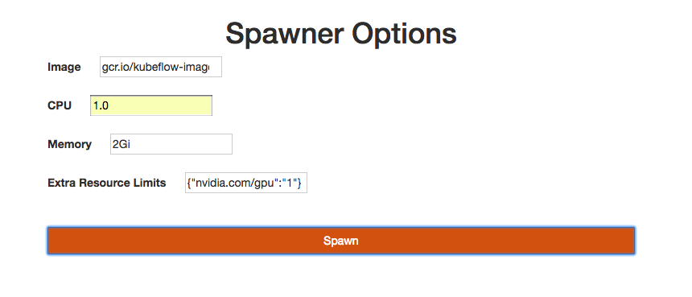

# Jupyter Notebooks on Kubernetes

## Prerequisites  
* [1 - Docker Basics](../1-docker)
* [2 - Kubernetes Basics and cluster created](../2-kubernetes)
* [4 - Kubeflow](../4-kubeflow)

## Summary

In this module, you will learn how to:
* Run Jupyter Notebooks locally using Docker
* Run JupyterHub on Kubernetes using Kubeflow
 
## How Jupyter Notebooks work

The [Jupyter Notebook](http://jupyter.org/) is an open source web application that allows users to create and share documents that contain live code, equations, visualizations, and narrative text for rapid prototyping. It is often used for data cleaning and transformation, numerical simulation, statistical modeling, data visualization, machine learning, and more. To better support exploratory iteration and to accelerate computation of Tensorflow jobs, let's look at how we can include data science tools like Jupyter Notebook with Docker and Kubernetes.

## How JupyterHub works

The [JupyterHub](https://jupyterhub.readthedocs.io/en/latest/) is a multi-user Hub, spawns, manages, and proxies multiple instances of the single-user Jupyter notebook server. JupyterHub can be used to serve notebooks to a class of students, a corporate data science group, or a scientific research group. Let's look at how we can create JupyterHub to spawn multiple instances of Jupyter Notebook on Kubernetes using Kubeflow.

## Exercises

### Exercise 1: Run Jupyter Notebooks locally using Docker

In this first exercise, we will run Jupyter Notebooks locally using Docker. We will use the official tensorflow docker image as it comes with Jupyter notebook.

```console
docker run -it -p 8888:8888 tensorflow/tensorflow
```

#### Validation

To verify, browse to the url in the output log. 

For example: `http://localhost:8888/?token=a3ea3cd914c5b68149e2b4a6d0220eca186fec41563c0413`


### Exercise 2: Run JupyterHub on Kubernetes using Kubeflow

In this exercise, we will run JupyterHub to spawn multiple instances of Jupyter Notebooks on a Kubernetes cluster using Kubeflow. 

As a prerequisite, you should already have a Kubernetes cluster running, you can follow [module 2 - Kubernetes](../2-kubernetes) to create your own cluster and you should already have Kubeflow running in your Kubernetes cluster, you can follow [module 4 - Kubeflow and tfjob Basics](../4-kubeflow-tfjob). 

In module 4, you installed the kubeflow-core component, which already includes JupyterHub and a corresponding load balancer service of type `ClusterIP`. To check its status, run the following kubectl command.

```
kubectl get svc -n=${NAMESPACE}

NAME               TYPE           CLUSTER-IP      EXTERNAL-IP   PORT(S)        AGE
...
tf-hub-0           ClusterIP      None            <none>        8000/TCP       1m
tf-hub-lb          ClusterIP      10.0.40.191    <none>        80/TCP         1m
```

To connect to your JupyterHub locally:

```
PODNAME=`kubectl get pods --namespace=${NAMESPACE} --selector="app=tf-hub" --output=template --template="{{with index .items 0}}{{.metadata.name}}{{end}}"`
kubectl port-forward --namespace=${NAMESPACE} $PODNAME 8000:8000
```

[Optional] To connect to your JupyterHub over a public IP:

To update the default service created for JupyterHub, run the following command to change the service to type LoadBalancer:

```
ks param set kubeflow-core jupyterHubServiceType LoadBalancer
ks apply ${YOUR_KF_ENV}

# YOUR_KF_ENV=default if you are continuing from previous module
```

Create a new Jupyter Notebook instance:
- open http://127.0.0.1:8000 in your browser (or use the public IP for the service `tf-hub-lb`)
- log in using any username and password 
- click the "Start My Server" button to sprawn a new Jupyter notebook
- from the image dropdown, select a tensorflow image for your notebook
- for CPU and memory, enter values based on your resource requirements, for example: 1 CPU and 2Gi
- to get available GPUs in your cluster, run the following command:
```
kubectl get nodes "-o=custom-columns=NAME:.metadata.name,GPU:.status.allocatable.alpha\.kubernetes\.io\/nvidia-gpu"
```
- for GPU, enter values in json format `{"nvidia.com/gpu":"1"}`
- click the "Spawn" button



The images are quite large. This process can take a long time.

#### Validation

You can check the status of the pod by running:

```
kubectl -n ${NAMESPACE} describe pods jupyter-${USERNAME}
```

After the pod status changes to `running`, to verify you will see a new Jupyter notebook running at: http://127.0.0.1:8000/user/{USERNAME}/tree or http://{PUBLIC-IP}/user/{USERNAME}/tree


## Next Step

[6 - TfJob](../6-tfjob)
