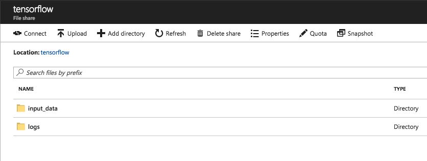
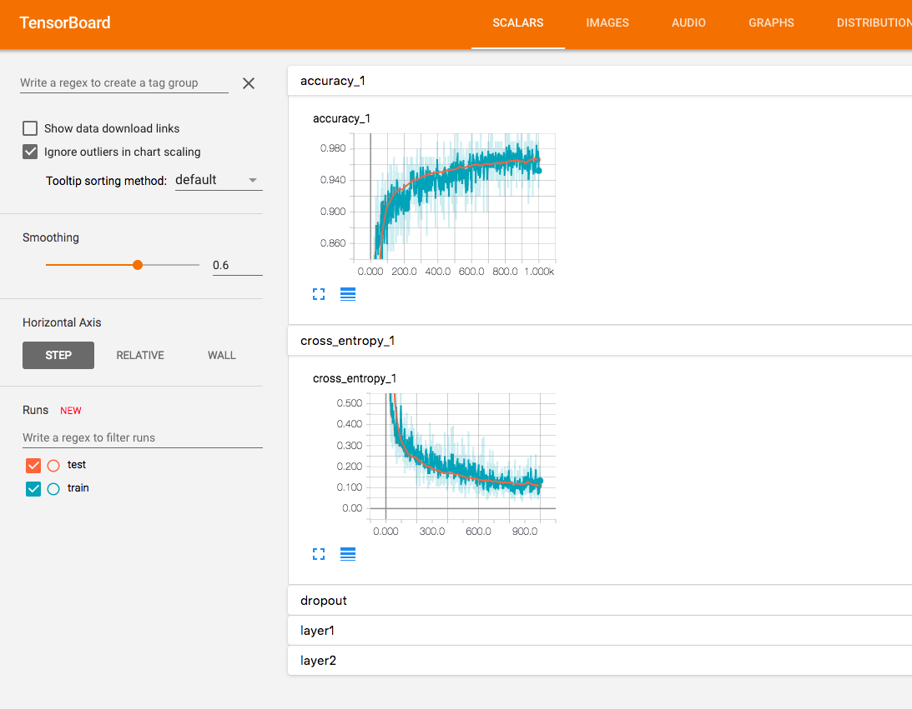

# `tensorflow/k8s` and `TFJob`

## Prerequisites

* [3 - Helm](../3-helm/README.md)
* [4 - GPUs](../4-gpus/README.md)  

## Summary

In this module you will learn how [`tensorflow/k8s`](https://github.com/tensorflow/k8s) can greatly simplify our lives when running TensorFlow on Kubernetes.

## `tensorflow/k8s`

As we saw earlier, giving a container access to GPU is not exactly a breeze on Kubernetes: We need to manually mount the drivers from the node into the container.    
If you already tried to run a distributed TensorFlow training, you know that it's not easy either. Getting the `ClusterSpec` right can be painful if you have more than a couple VMs, and it's also quite brittle (we will look more into distributed TensorFlow in module [6 - Distributed TensorFlow](../6-distributed-tensorflow/README.md)).
  
`tensorflow/k8s` is a new project in TensorFlow's organization on GitHub that makes all of this much easier.  


### Installing `tensorflow/k8s`

Installing `tensorflow/k8s` with Helm is very easy, just run the following commands:

```console
> CHART=https://storage.googleapis.com/tf-on-k8s-dogfood-releases/latest/tf-job-operator-chart-latest.tgz
> helm install ${CHART} -n tf-job --wait --replace --set cloud=azure
```

If it worked, you should see something like:

```
NAME:   tf-job
LAST DEPLOYED: Mon Nov 20 14:24:16 2017
NAMESPACE: default
STATUS: DEPLOYED

RESOURCES:
==> v1/ConfigMap
NAME                    DATA  AGE
tf-job-operator-config  1     7s

==> v1beta1/Deployment
NAME             DESIRED  CURRENT  UP-TO-DATE  AVAILABLE  AGE
tf-job-operator  1        1        1           1          7s

==> v1/Pod(related)
NAME                              READY  STATUS   RESTARTS  AGE
tf-job-operator-3005087210-c3js3  1/1    Running  1         4s
```

This means that 3 resources were created, a `ConfigMap`, a `Deployment`, and a `Pod`.  
We will see in just a moment what each of them do.

### Kubernetes Custom Resource Definition

Kubernetes has a concept of [Custom Resources](https://kubernetes.io/docs/concepts/api-extension/custom-resources/) (often abbreviated CRD) that allows us to create custom object that we will then be able to use.
In the case of `tensorflow/k8s`, after installation, a new `TFJob` object will be available in our cluster. This object allows us to describe TensorFlow a training.

#### `TFJob` Specifications

Before going further, let's take a look at what the `TFJob` looks like:

> Note: Some of the fields are not described here for brevity.

**`TFJob` Object**
  
| Field | Type| Description |
|-------|-----|-------------| 
| apiVersion | `string` | Versioned schema of this representation of an object. In our case, it's `kubeflow.org/v1alpha1` |
| kind | `string` |  Value representing the REST resource this object represents. In our case it's `TFJob` |
| metadata | [`ObjectMeta`](https://github.com/kubernetes/community/blob/master/contributors/devel/api-conventions.md#metadata)| Standard object's metadata. |
| spec | `TFJobSpec` | The actual specification of our TensorFlow job, defined below. |

`spec` is the most important part, so let's look at it too:

**`TFJobSpec` Object**

| Field | Type| Description |
|-------|-----|-------------|
| ReplicaSpecs | `TFReplicaSpec` array | Specification for a set of TensorFlow processes, defined below |

Let's go deeper: 

**`TFReplicaSpec` Object**

| Field | Type| Description |
|-------|-----|-------------|
| TfReplicaType | `string` | What type of replica are we defining? Can be `MASTER`, `WORKER` or `PS`. When not doing distributed TensorFlow, we just use `MASTER` which happens to be the default value. | 
| Replicas | `int` | Number of replicas of `TfReplicaType`. Again this is useful only for distributed TensorFLow. Default value is `1`. |
| Template | [`PodTemplateSpec`](https://kubernetes.io/docs/api-reference/v1.8/#podtemplatespec-v1-core) | Describes the pod that will be created when executing a job. This is the standard Pod description that we have been using everywhere.  |


As a refresher, here is what a simple TensorFlow training (with GPU) would look like using "vanilla" kubernetes:

```yaml
apiVersion: batch/v1
kind: Job
metadata:
  name: example-job
spec:
  template:
    metadata:
      name: example-job
    spec:
      restartPolicy: OnFailure
      volumes:
      - name: bin
        hostPath: 
          path: /usr/lib/nvidia-384/bin
      - name: lib
        hostPath: 
          path: /usr/lib/nvidia-384
      containers:
      - name: tensorflow
        image: wbuchwalter/<SAMPLE IMAGE>
        resources:
          requests:
            alpha.kubernetes.io/nvidia-gpu: 1 
        volumeMounts:
        - name: bin
          mountPath: /usr/local/nvidia/bin
        - name: lib
          mountPath: /usr/local/nvidia/lib64
```
Here is what the same thing looks like using the new `TFJob` resource:

```yaml
apiVersion: kubeflow.org/v1alpha1
kind: TFJob
metadata:
  name: example-tfjob
spec:
  replicaSpecs:
    - template:
        spec:
          containers:
            - image: wbuchwalter/<SAMPLE IMAGE>
              name: tensorflow
              resources:
                requests:
                  alpha.kubernetes.io/nvidia-gpu: 1
          restartPolicy: OnFailure
```

No need to mount drivers anymore! Note that we are not specifying `TfReplicaType` or `Replicas` as the default values are already what we want.

#### How does this work?

As we saw earlier, when we installed the Helm chart for `tensorflow/k8s`, 3 resources were created in our cluster:
* A `ConfigMap` named `tf-job-operator-config`
* A `Deployment`
* And a `Pod` named `tf-job-operator`

The `tf-job-operator` pod (simply called the operator, or `TFJob` operator), is going to monitor your cluster, and every time you create a new resource of type `TFJob`, the operator will know what to do with it.
Specifically, when you create a new `TFJob`, the operator will create a new Kubernetes `Job` for it, and automatically mount the drivers if needed (i.e. when you request a GPU).

You may wonder how the operator knows which directory needs to be mounted in the container for the NVIDIA drivers: that's where the `ConfigMap` comes into play.  

In K8s, a [`ConfigMap`](https://kubernetes.io/docs/tasks/configure-pod-container/configmap/) is a simple object that contains key-value pairs. This `ConfigMap` can then be linked with a container to inject some configuration.   

When we installed the Helm chart, we specified which cloud provider we are running on by doing `--set cloud=azure`. 
This creates a `ConfigMap` that contains configuration options specific for Azure, including the list of directory to mount.

We can take a look at what is inside our `tf-job-operator-config` by doing:

```console
kubectl describe configmaps tf-job-operator-config
```

The output is:

```
Name:		tf-job-operator-config
Namespace:	default
Labels:		<none>
Annotations:	<none>

Data
====
controller_config_file.yaml:
----
grpcServerFilePath: /opt/mlkube/grpc_tensorflow_server/grpc_tensorflow_server.py
accelerators:
  alpha.kubernetes.io/nvidia-gpu:
    volumes:
      - name: lib
        mountPath: /usr/local/nvidia/lib64
        hostPath:  /usr/lib/nvidia-384
      - name: bin
        mountPath: /usr/local/nvidia/bin
        hostPath: /usr/lib/nvidia-384/bin
      - name: libcuda
        mountPath: /usr/lib/x86_64-linux-gnu/libcuda.so.1
        hostPath: /usr/lib/x86_64-linux-gnu/libcuda.so.1
```

If you want to know more:
* [tensorflow/k8s](https://github.com/tensorflow/k8s) GitHub repository
* [Introducing Operators](https://coreos.com/blog/introducing-operators.html), a blog post by CoreOS explaining the Operator pattern

## Exercises 

### Exercise 1: A Simple `TFJob`

Let's schedule a very simple TensorFlow job using `TFJob` first.

> Note: If you completed the exercise in Module 1 and 2, you can change the image to use the one you pushed instead.

Depending on whether or not your cluster has GPU, choose the correct template:

<details>
<summary><strong>CPU Only</strong></summary>  
  
```yaml
apiVersion: kubeflow.org/v1alpha1
kind: TFJob
metadata:
  name: module5-ex1
spec:
  replicaSpecs:
    - template:
        spec:
          containers:
            - image: wbuchwalter/tf-mnist:cpu
              name: tensorflow
          restartPolicy: OnFailure
```

</details>

<details>
<summary><strong>With GPU</strong></summary>  

When using GPU, we need to request for one (or multiple), and the image we are using also needs to be based on TensorFlow's GPU image.

```yaml
apiVersion: kubeflow.org/v1alpha1
kind: TFJob
metadata:
  name: module5-ex1-gpu
spec:
  replicaSpecs:
    - template:
        spec:
          containers:
            - image: wbuchwalter/tf-mnist:gpu
              name: tensorflow
              resources:
                requests:
                  alpha.kubernetes.io/nvidia-gpu: 1
          restartPolicy: OnFailure
```

</details>  
  


Save the template that applies to you in a file, and create the `TFJob`:
```console
kubectl create -f <template-path>
```

Let's look at what has been created in our cluster.

First a `TFJob` was created:

```console
kubectl get tfjob
```
Returns:
```
NAME            KIND
module5-ex1   TFJob.v1alpha1.tensorflow.org
```

As well as a `Job`, which was actually created by the operator:

```console
kubectl get job
```
Returns:
```
NAME            DESIRED   SUCCESSFUL   AGE
module5-ex1-master-xs4b-0   1         0            2m
```
and a `Pod`:

```console
kubectl get pod
```
Returns:
```
NAME                                READY     STATUS      RESTARTS   AGE
module5-ex1-master-xs4b-0-6gpfn                 1/1       Running   0          2m
```

Note that the `Pod` might take a few minutes before actually running, the docker image needs to be pulled on the node first.

Once the `Pod`'s status is either `Running` or `Completed` we can start looking at it's logs:

```console 
kubectl logs <your-pod-name>
```

This container is pretty verbose, but you should see a TensorFlow training happening: 

```
[...]
INFO:tensorflow:2017-11-20 20:57:22.314198: Step 480: Cross entropy = 0.142486
INFO:tensorflow:2017-11-20 20:57:22.370080: Step 480: Validation accuracy = 85.0% (N=100)
INFO:tensorflow:2017-11-20 20:57:22.896383: Step 490: Train accuracy = 98.0%
INFO:tensorflow:2017-11-20 20:57:22.896600: Step 490: Cross entropy = 0.075210
INFO:tensorflow:2017-11-20 20:57:22.945611: Step 490: Validation accuracy = 91.0% (N=100)
INFO:tensorflow:2017-11-20 20:57:23.407756: Step 499: Train accuracy = 94.0%
INFO:tensorflow:2017-11-20 20:57:23.407980: Step 499: Cross entropy = 0.170348
INFO:tensorflow:2017-11-20 20:57:23.457325: Step 499: Validation accuracy = 89.0% (N=100)
INFO:tensorflow:Final test accuracy = 88.4% (N=353)
[...]
```

Once your job is completed, clean it up:

```console
kubectl delete tfjob module5-ex1
```

> That's great and all, but how do we grab our trained model and TensorFlow's summaries?  

Well currently we can't. As soon as the training is complete, the container stops and everything inside it, including model and logs are lost.  

Thankfully, Kubernetes `Volumes` can help us here.
If you remember, we quickly introduced `Volumes` in module [2 - Kubernetes](../2-kubernetes/), and that's what we already used to mount the drivers from the node into the container.  
But `Volumes` are not just for mounting things from a node, we can also use them to mount a lot of different storage solutions, you can see the full list [here](https://kubernetes.io/docs/concepts/storage/volumes/).  

In our case we are going to use Azure Files, as it is really easy to use with Kubernetes.

## Exercise 2: Azure Files to the Rescue

### Creating a New File Share and Kubernetes Secret

In the official documentation: [Using Azure Files with Kubernetes](https://docs.microsoft.com/en-in/azure/aks/azure-files), follow the steps listed under `Create an Azure file share` and `Create Kubernetes Secret`, but be aware of a few details first:
* It is **very** important that you create you storage account (hence your resource group) in the **same** region as your Kubernetes cluster: because Azure File uses the `SMB` protocol it won't work cross-regions. `AKS_PERS_LOCATION` should be updated accordingly.
* While this document specifically refers to AKS, it will work for any K8s cluster
* Name your file share `tensorflow`. While the share could be named anything, it will make it easier to follow the examples later on. `AKS_PERS_SHARE_NAME` should be updated accordingly.

Once you completed all the steps, run:
```console
kubectl get secrets
```

Which should return:
```
NAME                  TYPE                                  DATA      AGE
azure-secret          Opaque                                2         4m
```


### Updating our example to use our Azure File Share

Now we need to mount our new file share into our container so the model and the summaries can be persisted.  
Turns out mounting an Azure File share into a container is really easy, we simply need to reference our secret in the `Volume` definition:

```yaml
[...]
 containers:
  - image: <IMAGE>
    name: tensorflow
    volumeMounts:
      - name: azurefile
        mountPath: <MOUNT_PATH>
 volumes:
  - name: azurefile
    azureFile:
      secretName: azure-secret
      shareName: tensorflow
      readOnly: false
```

Update your template from exercise 1 to mount the Azure File share into your container,and create your new job.
Note that by default our container saves everything into `/app/tf_files` so that's the value you will want to use for `MOUNT_PATH`.

Once the container starts running, if you go to the Azure Portal, into your storage account, and browse your `tensorflow` file share, you should see something like that:



This means that when we run a training, all the important data is now stored in Azure File and is still available as long as we don't delete the file share.

#### Solution for Exercise 2

*For brevity, the solution show here is for CPU-only training. If you are using GPU, don't forget to update the image tag as well as adding a GPU request.*

<details>
<summary><strong>Solution</strong></summary>  

```yaml
apiVersion: kubeflow.org/v1alpha1
kind: TFJob
metadata:
  name: module5-ex2
spec:
  replicaSpecs:
    - template:
        spec:
          containers:
            - image: wbuchwalter/tf-mnist:cpu
              name: tensorflow
              volumeMounts:
                # By default our classifier saves the summaries in /tmp/tensorflow,
                # so that's where we want to mount our Azure File Share.
                - name: azurefile
                  # The subPath allows us to mount a subdirectory within the azure file share instead of root
                  # this is useful so that we can save the logs for each run in a different subdirectory
                  # instead of overwriting what was done before.
                  subPath: module5-ex2
                  mountPath: /tmp/tensorflow 
          volumes:
            - name: azurefile
              azureFile:
                # We reference the secret we created just earlier 
                # so that the account name and key are passed securely and not directly in a template
                secretName: azure-secret
                shareName: tensorflow
                readOnly: false
          restartPolicy: OnFailure
```

</details>


**Don't forget to delete the `TFJob` once it is completed!**

> Great, but what if I want to check out the training in TensorBoard, do I need to download everything on my machine?

Actually no, you don't. `TFJob` provides a very handy mechanism to monitor your trainings with TensorBoard easily!
We will try that in our third exercise.

### Exercise 3: Adding TensorBoard

So far, we have a TensorFlow training running, and it's model and summaries are persisted to an Azure File share.  
But having TensorBoard monitoring the training would be pretty useful as well.
Turns out `TFJob` can also help us with that.

When we looked at the `TFJob` specification at the beginning of this module, we omitted some fields in `TFJobSpec` descriptions.
Here is a still incomplete but more accurate representation with one additional field:

**`TFJobSpec` Object**

| Field | Type| Description |
|-------|-----|-------------|
| ReplicaSpecs | `TFReplicaSpec` array | Specification for a set of TensorFlow processes. |
| **TensorBoard** | `TensorBoardSpec` | Configuration to start a TensorBoard deployment associated to our training job. Defined below. |

That's right, `TFJobSpec` contains an object of type `TensorBoadSpec` which allows us to describe a TensorBoard instance!
Let's look at it:

**`TensorBoardSpec` Object**

| Field | Type| Description |
|-------|-----|-------------|
| LogDir | `string` | Location of TensorFlow summaries in the TensorBoard container. |
| ServiceType | [`ServiceType`](https://kubernetes.io/docs/concepts/services-networking/service/#publishing-services---service-types) | What kind of service should expose TensorBoard. Usually `ClusterIP` (Only reachable from within the cluster) or `LoadBalancer` (Exposes the service externally using a cloud provider’s load balancer. ) |
| Volumes | [`Volume`](https://kubernetes.io/docs/api-reference/v1.8/#volume-v1-core) array | List of volumes that can be mounted.  |
| VolumeMounts | [`VolumeMount`](https://kubernetes.io/docs/api-reference/v1.8/#volumemount-v1-core) array | Pod volumes to mount into the container's filesystem. |


Let's add TensorBoard to our job then.
Here is how this will work: We will keep the same TensorFlow training job as in exercise 2. This `TFJob` will write the model and summaries in the Azure File share.
We will also set up the configuration for TensorBoard so that it reads the summaries from the same Azure File share:
* `Volumes` and `VolumeMounts` in `TensorBoardSpec` should be updated adequately.
* For `ServiceType`, you should use `LoadBalancer`, this will create a public IP so it will be easier to access.
* `LogDir` will depend on how you configure `VolumeMounts`, but on your file share, the summaries will be under the `training_summaries` sub directory.

#### Solution for Exercise 3

*For brevity, the solution show here is for CPU-only training. If you are using GPU, don't forget to update the image tag as well as adding a GPU request.*

<details>
<summary><strong>Solution</strong></summary>  

```yaml
apiVersion: kubeflow.org/v1alpha1
kind: TFJob
metadata:
  name: module5-ex3
spec:
  replicaSpecs:
    - template:
        spec:
          volumes:
            - name: azurefile
              azureFile:
                  secretName: azure-secret
                  shareName: tensorflow
                  readOnly: false
          containers:
            - image: wbuchwalter/tf-mnist:cpu
              name: tensorflow
              volumeMounts:
                - mountPath: /tmp/tensorflow
                  subPath: module5-ex3 # Again we isolate the logs in a new directory on Azure Files
                  name: azurefile
          restartPolicy: OnFailure
  tensorboard:
    logDir: /tmp/tensorflow/logs
    serviceType: LoadBalancer # We request a public IP for our TensorBoard instance
    volumes:
      - name: azurefile
        azureFile:
            secretName: azure-secret
            shareName: tensorflow
    volumeMounts:
      - mountPath: /tmp/tensorflow/ #This could be any other path. All that maters is that LogDir reflects it.
        subPath: module5-ex3 # This should match the directory our Master is actually writing in
        name: azurefile
```
</details>


#### Validation

If you updated the `TFJob` template correctly, when doing:
```console
kubectl get services
```
You should see something like:
```
NAME                           CLUSTER-IP     EXTERNAL-IP     PORT(S)        AGE
kubernetes                     10.0.0.1       <none>          443/TCP        14d
module5-ex3-master-7yqt-0      10.0.126.11    <none>          2222/TCP       5m
module5-ex3-tensorboard-7yqt   10.0.199.170   104.42.193.76   80:31770/TCP   5m
```
Note that provisioning a public IP on Azure can take a few minutes. During this time the `EXTERNAL-IP` for TensorBoard's service will show as `<pending>`.  

Once the public IP is provisioned, browse it, and you should land on a working TensorBoard instance with live monitoring of the training job running.



## Next Step

[6 - Distributed TensorFlow](../6-distributed-tensorflow)
