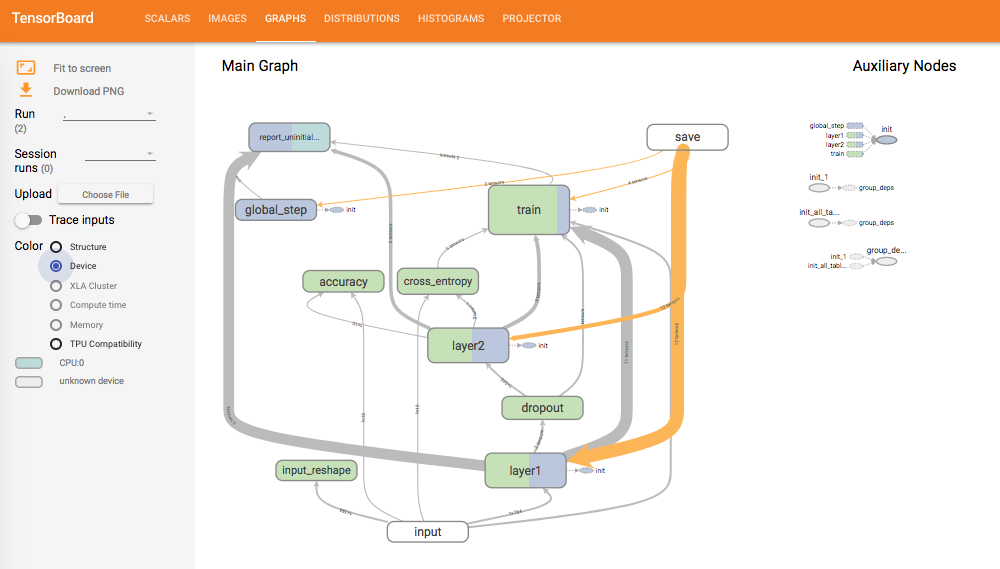

# Distributed TensorFlow with `TFJob`

## Prerequisites

[5 - TFJob](../5-tfjob/)

## Summary

In this module we will see how `TFJob` can greatly simplify the deployment and monitoring of distributed TensorFlow trainings.
  
## "Vanilla" Distributed TensorFlow is Hard

First let's see how we would setup a distributed TensorFlow training without Kubernetes or `TFJob` (fear not, we are not actually going to do that).
First, you would have to find or setup a bunch of idle VMs, or physical machines. In most companies, this would already be a feat, and likely require the coordination of multiple department (such as IT) to get the VMs up, running and reserved for your experiment. 
Then you would likely have to do some back and forth with the IT department to be able to setup your training: the VMs need to be able to talk to each others and have stable endpoints. Work might be needed to access the data, you would need to upload your TF code on every single machine etc.  
If you add GPU to the mix, it would likely get even harder since GPUs aren't usually just waiting there because of their high cost.  

Assuming you get through this, you now need to modify your model for distributed training.  
Among other things, you will need to setup the `ClusterSpec` ([`tf.train.ClusterSpec`](https://www.tensorflow.org/api_docs/python/tf/train/ClusterSpec)):  a TensorFlow class that allows you to describe the architecture of your cluster. 
For example, if you were to setup a distributed training with a mere 2 workers and 2 parameter servers, your cluster spec would look like this (the `clusterSpec` would most likely not be hardcoded, but passed as argument to your training script as we will see below, this is for illustration):

```python
cluster = tf.train.ClusterSpec({"worker": ["<IP_GPU_VM_1>:2222",
                                           "<IP_GPU_VM_2>:2222"],
                                "ps": ["<IP_CPU_VM_1>:2222",
                                       "<IP_CPU_VM_2>:2222"]})
```
Here we assume that you want your workers to run on GPU VMs and your parameter servers to run on CPU VMs.  

We will not go through the rest of the modifications needed (splitting operation across devices, getting the master session etc.), as we will look at them later and this would be pretty much the same thing no matter how you run your distributed training.

Once your model is ready, you need to start the training.  
You will need to connect to every single VM, and pass the `ClusterSpec` as well as the assigned job name (ps or worker) and task index to each VM. 
So it would look something like this:

```bash
# On ps0:
$ python trainer.py \
     --ps_hosts=<IP_CPU_VM_1>:2222,<IP_CPU_VM_2>:2222 \
     --worker_hosts=<IP_GPU_VM_1>:2222,<IP_GPU_VM_2>:2222 \
     --job_name=ps --task_index=0
# On ps1:
$ python trainer.py \
     --ps_hosts=<IP_CPU_VM_1>:2222,<IP_CPU_VM_2>:2222 \
     --worker_hosts=<IP_GPU_VM_1>:2222,<IP_GPU_VM_2>:2222 \
     --job_name=ps --task_index=1
# On worker0:
$ python trainer.py \
     --ps_hosts=<IP_CPU_VM_1>:2222,<IP_CPU_VM_2>:2222 \
     --worker_hosts=<IP_GPU_VM_1>:2222,<IP_GPU_VM_2>:2222 \
     --job_name=worker --task_index=0
# On worker1:
$ python trainer.py \
     --ps_hosts=<IP_CPU_VM_1>:2222,<IP_CPU_VM_2>:2222 \
     --worker_hosts=<IP_GPU_VM_1>:2222,<IP_GPU_VM_2>:2222 \
     --job_name=worker --task_index=1
```

At this point your training would finally start.  
However, if for some reason an IP changes (a VM restarts for example), you would need to go back on every VM in your cluster, and restart the training with an updated `ClusterSpec` (If the IT department of your company is feeling extra-generous they might assign a DNS name to every VM which would already make your life much easier).
If you see that your training is not doing well and you need to update the code, you have to redeploy it on every VM and restart the training everywhere.
If for some reason you want to retrain after a while, you would most likely need to go back to step 1: ask for the VMs to be allocated, redeploy, update the `clusterSpec`.

All this hurdles means that in practice very few people actually bother with distributed training as the time gained during training might not be worth the energy and time necessary to set it up correctly.

## Distributed TensorFlow with Kubernetes and `TFJob`

Thankfully, with Kubernetes and `TFJob` things are much, much simpler, making distributed training something you might actually be able to benefit from.


#### A Small Disclaimer
The issues we saw in the first part of this module can be categorized in two groups: 
* Issues with getting access to enough resources for the trainings (VMs, GPU etc)
* Issues with setting up the training itself

The first group of issue is still very dependent on the processes in your company/group. If you need to go through a formal request to get access to extra VMs/GPU, it will still be a hassle and there is nothing Kubernetes can do about that.  
However, Kubernetes makes this process much easier:
* On ACS and AKS you can spin up new VMs with a single command: [`az <acs|aks> scale`](https://docs.microsoft.com/en-us/cli/azure/aks?view=azure-cli-latest#az_aks_scale)
* On acs-engine you can setup autoscaling so that anytime you schedule a training on Kubernetes, the autoscaler will make sure your cluster has all the resources it need to run it, and when your training is completed, it will shut down any idle VMs, making this the best solution in term of cost and effort. While autoscaling is outside the scope of this workshop we will give you pointers in module [8 - Going Further](../8-going-further).

Setting up the training, however, is drastically simplified with Kubernetes and `TFJob`.

### Overview of `TFJob` distributed training

So, how does `TFJob` works for distributed training?
Let's look again at what the `TFJobSpec`and `TFReplicaSpec` objects looks like:

**`TFJobSpec` Object**

| Field | Type| Description |
|-------|-----|-------------|
| ReplicaSpecs | `TFReplicaSpec` array | Specification for a set of TensorFlow processes, defined below |


**`TFReplicaSpec` Object**

Note the last parameter `IsDefaultPS` that we didn't talk about before.

| Field | Type| Description |
|-------|-----|-------------|
| TfReplicaType | `string` | What type of replica are we defining? Can be `MASTER`, `WORKER` or `PS`. When not doing distributed TensorFlow, we just use `MASTER` which happens to be the default value. | 
| Replicas | `int` | Number of replicas of `TfReplicaType`. Again this is useful only for distributed TensorFLow. Default value is `1`. |
| Template | [`PodTemplateSpec`](https://kubernetes.io/docs/api-reference/v1.8/#podtemplatespec-v1-core) | Describes the pod that will be created when executing a job. This is the standard Pod description that we have been using everywhere.  |
| **IsDefaultPS** | `boolean` | Whether the parameter server should be using a default image or a custom one (default to `true`) |

In case the distinction between master and workers is not clear, there is a single master per TensorFlow cluster, and it is in fact a worker. The difference is that the master is the worker that is going to handle the creation of the `tf.Session`, write logs and save the model.

As you can see, `TFJobSpec` and `TFReplicaSpec` allow us to easily define the architecture of the TensorFlow cluster we would like to setup.

Once we have defined this architecture in a `TFJob` template and deployed it with `kubectl create`, the operator will do most of the work for us.
For each master, worker and parameter server in our TensorFlow cluster, the operator will create a service exposing it so they can communicate.   
It will then create an internal representation of the cluster with each node and it's associated internal DNS name.  

For example, if you were to create a `TFJob` with 1 `MASTER`, 2 `WORKERS` and 1 `PS`, this representation would look similar to this:
```json
{  
    "master":[  
        "distributed-mnist-master-5oz2-0:2222"
    ],
    "ps":[  
        "distributed-mnist-ps-5oz2-0:2222"
    ],
    "worker":[  
        "distributed-mnist-worker-5oz2-0:2222",
        "distributed-mnist-worker-5oz2-1:2222"
    ]
}
```

Finally, the operator will create all the necessary pods, and in each one, inject an environment variable named `Tf_CONFIG`, containing the cluster specification above, as well as the respective job name and task id that each node of the TensorFlow cluster should assume.  

For example, here is the value of the `TF_CONFIG` environment variable that would be sent to worker 1:

```json
{  
   "cluster":{  
      "master":[  
         "distributed-mnist-master-5oz2-0:2222"
      ],
      "ps":[  
         "distributed-mnist-ps-5oz2-0:2222"
      ],
      "worker":[  
         "distributed-mnist-worker-5oz2-0:2222",
         "distributed-mnist-worker-5oz2-1:2222"
      ]
   },
   "task":{  
      "type":"worker",
      "index":1
   },
   "environment":"cloud"
}
```

As you can see, this completely takes the responsibility of building and maintaining the `ClusterSpec` away from you.
All you have to do, is modify your code to read the `TF_CONFIG` and act accordingly.

### Modifying your model to use `TFJob`'s `TF_CONFIG`

Concretely, let's see how you would modify your code:

```python
# Grab the TF_CONFIG environment variable
tf_config_json = os.environ.get("TF_CONFIG", "{}")

# Deserialize to a python object
tf_config = json.loads(tf_config_json)

# Grab the cluster specification from tf_config and create a new tf.train.ClusterSpec instance with it
cluster_spec = tf_config.get("cluster", {})
cluster_spec_object = tf.train.ClusterSpec(cluster_spec)

# Grab the task assigned to this specific process from the config. job_name might be "worker" and task_id might be 1 for example
task = tf_config.get("task", {})
job_name = task["type"]
task_id = task["index"]

# Configure the TensorFlow server
server_def = tf.train.ServerDef(
    cluster=cluster_spec_object.as_cluster_def(),
    protocol="grpc",
    job_name=job_name,
    task_index=task_id)
server = tf.train.Server(server_def)

# checking if this process is the chief (also called master). The master has the responsibility of creating the session, saving the summaries etc.
is_chief = (job_name == 'master')

# Notice that we are not handling the case where job_name == 'ps'. That is because `TFJob` will take care of the parameter servers for us by default.
```

As for any distributed TensorFlow training, you will then also need to modify your model to split the operations and variables among the workers and parameter servers as well as create on session on the master.

## Exercises

### 1 - Modifying Our MNIST Example to Support Distributed Training

#### 1. a.
Starting from the MNIST sample we have been working with so far, modify it to work with distributed TensorFlow and `TFJob`.
You will then need to build the image and push it (you should push it under a different name or tag to avoid overwriting what you did before).

#### 1. b.

Modify the yaml template from module [5 - TFJob](../5-tfjob) exercise 3, to instead deploy 1 master, 2 workers and 1 PS. We also want to monitor the training with TensorBoard.
Note that since our model is very simple, TensorFlow will likely use only 1 of the workers, but it will still work fine.
Don't forget to update the image or tag.

#### Validation

```console
kubectl get pods
```

Should yield:

```
NAME                                                 READY     STATUS    RESTARTS   AGE
module6-ex1-master-3khk-0-fkm8p                 1/1       Running       0          39s
module6-ex1-ps-3khk-0-rqkv5                     1/1       Running       0          39s
module6-ex1-tensorboard-3khk-2845579357-75rtd   1/1       Running       0          39s
module6-ex1-worker-3khk-0-jsm8c                 1/1       Running       0          39s
module6-ex1-worker-3khk-1-8rgh4                 1/1       Running       0          39s
```

looking at the logs of the master with:

```console
kubectl logs <master-pod-name>
```

Should yield:

```
[...]
Initialize GrpcChannelCache for job master -> {0 -> localhost:2222}
Initialize GrpcChannelCache for job ps -> {0 -> distributed-mnist-ps-5oz2-0:2222}
Initialize GrpcChannelCache for job worker -> {0 -> distributed-mnist-worker-5oz2-0:2222, 1 -> distributed-mnist-worker-5oz2-1:2222}
2017-12-01 20:10:11.826258: I tensorflow/core/distributed_runtime/rpc/grpc_server_lib.cc:324] Started server with target: grpc://localhost:2222
2017-12-01 20:10:14.395476: I tensorflow/core/distributed_runtime/master_session.cc:1004] Start master session 87c6df6850b8f074 with config:
```

This indicates that the `ClusterSpec` was correctly extracted from the environment variable and given to TensorFlow.

Once TensorBoard public IP is successfully provisioned (check with `kubectl get svc`), go in TensorBoard's graph section and change the color to Device in the left menu.
You should see that your model is indeed correctly distributed between workers and PS:  

  

Again, since our model is very simple, TensorFlow will most likely only use a single worker.

After a few minutes, the status of both worker nodes should show as `Completed` when doing `kubectl get pods -a`.

#### Solution


A working code sample is available in [`solution-src/main.py`](./solution-src/main.py).

<details>
<summary><strong>TFJob's Template</strong></summary>

```yaml
apiVersion: kubeflow.org/v1alpha1
kind: TFJob
metadata:
  name: module6-ex1
spec:
  tensorboard: # Specification fot the TensorBoard instance that is going to monitor our training
    logDir: /tmp/tensorflow/logs
    serviceType: LoadBalancer
    volumes:
      - name: azurefile
        azureFile:
            secretName: azure-secret
            shareName: tensorflow
    volumeMounts:
      - mountPath: /tmp/tensorflow 
        subPath: module6-ex1
        name: azurefile
  replicaSpecs:
    - replicas: 1 # 1 Master
      tfReplicaType: MASTER
      template:
        spec:
          volumes:
            - name: azurefile
              azureFile:
                  secretName: azure-secret
                  shareName: tensorflow
                  readOnly: false
          containers:
            - image: wbuchwalter/tf-mnist:distributed  # You can replace this by your own image           
              name: tensorflow
              imagePullPolicy: Always
              volumeMounts:
                - mountPath: /tmp/tensorflow
                  subPath: module6-ex1
                  name: azurefile
          restartPolicy: OnFailure
    - replicas: 2 # 2 Workers
      tfReplicaType: WORKER
      template:
        spec:
          containers:
            - image: wbuchwalter/tf-mnist:distributed  # You can replace this by your own image                       
              name: tensorflow
              imagePullPolicy: Always
          restartPolicy: OnFailure
    - replicas: 1  # 1 Parameter server
      tfReplicaType: PS
```

There are two things to notice here:
* Since only the master will be saving the model and the summaries, we only need to mount the Azure File share on the master's `replicaSpec`, not on the `workers` or `ps`.
* We are not specifying anything for the `PS` `replicaSpec` except the number of replicas. This is because `IsDefaultPS` is set to `true` by default. This means that the parameter server(s) will be started with a pre-built docker image that is already configured to read the `TF_CONFIG` and act as a TensorFlow server, so we don't need to do anything here.

</details>


## Next Step

[7 - Hyperparameters Sweep with Helm](../7-hyperparam-sweep)
