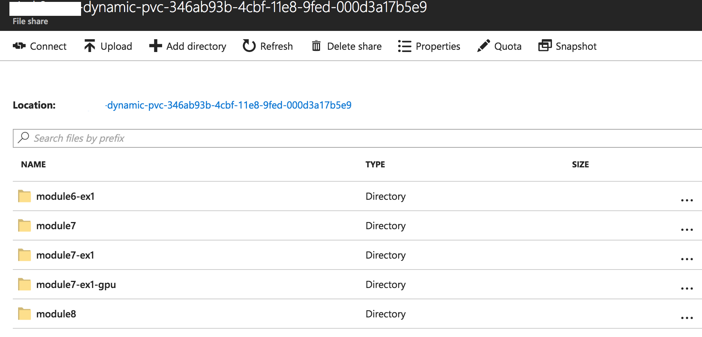

# `TFJob`

## Prerequisites

* [1 - Docker](../1-docker/README.md)
* [2 - Kubernetes](../2-kubernetes/README.md)
* [4 - Kubeflow](../4-kubeflow/README.md)

## Summary

In this module you will learn how to describe a TensorFlow training using `TfJob` object.


### Kubernetes Custom Resource Definition

Kubernetes has a concept of [Custom Resources](https://kubernetes.io/docs/concepts/api-extension/custom-resources/) (often abbreviated CRD) that allows us to create custom object that we will then be able to use.
In the case of Kubeflow, after installation, a new `TFJob` object will be available in our cluster. This object allows us to describe a TensorFlow training.

#### `TFJob` Specifications

Before going further, let's take a look at what the `TFJob` object looks like:

> Note: Some of the fields are not described here for brevity.

**`TFJob` Object**

| Field | Type| Description |
|-------|-----|-------------| 
| apiVersion | `string` | Versioned schema of this representation of an object. In our case, it's `kubeflow.org/v1alpha1` |
| kind | `string` |  Value representing the REST resource this object represents. In our case it's `TFJob` |
| metadata | [`ObjectMeta`](https://github.com/kubernetes/community/blob/master/contributors/devel/api-conventions.md#metadata)| Standard object's metadata. |
| spec | `TFJobSpec` | The actual specification of our TensorFlow job, defined below. |

`spec` is the most important part, so let's look at it too:

**`TFJobSpec` Object**

| Field | Type| Description |
|-------|-----|-------------|
| ReplicaSpecs | `TFReplicaSpec` array | Specification for a set of TensorFlow processes, defined below |

Let's go deeper: 

**`TFReplicaSpec` Object**

| Field | Type| Description |
|-------|-----|-------------|
| TfReplicaType | `string` | What type of replica are we defining? Can be `MASTER`, `WORKER` or `PS`. When not doing distributed TensorFlow, we just use `MASTER` which happens to be the default value. | 
| Replicas | `int` | Number of replicas of `TfReplicaType`. Again this is useful only for distributed TensorFLow. Default value is `1`. |
| Template | [`PodTemplateSpec`](https://kubernetes.io/docs/api-reference/v1.8/#podtemplatespec-v1-core) | Describes the pod that will be created when executing a job. This is the standard Pod description that we have been using everywhere.  |

Here is what a simple TensorFlow training looks like using this `TFJob` object:

```yaml
apiVersion: kubeflow.org/v1alpha1
kind: TFJob
metadata:
  name: example-tfjob
spec:
  replicaSpecs:
    - template:
        spec:
          containers:
            - image: wbuchwalter/<SAMPLE IMAGE>
              name: tensorflow
              resources:
                limits:
                  alpha.kubernetes.io/nvidia-gpu: 1
          restartPolicy: OnFailure
```

Note that we are note specifying `TfReplicaType` or `Replicas` as the default values are already what we want.

## Exercises 

### Exercise 1: A Simple `TFJob`

Let's schedule a very simple TensorFlow job using `TFJob` first.

> Note: If you completed the exercise in Module 1 and 2, you can change the image to use the one you pushed instead.

When using GPU, we need to request for one (or multiple), and the image we are using also needs to be based on TensorFlow's GPU image.

```yaml
apiVersion: kubeflow.org/v1alpha1
kind: TFJob
metadata:
  name: module5-ex1-gpu
spec:
  replicaSpecs:
    - template:
        spec:
          containers:
            - image: wbuchwalter/tf-mnist:gpu
              name: tensorflow
              resources:
                limits:
                  alpha.kubernetes.io/nvidia-gpu: 1
          restartPolicy: OnFailure
```

Save the template that applies to you in a file, and create the `TFJob`:
```console
kubectl create -f <template-path>
```

Let's look at what has been created in our cluster.

First a `TFJob` was created:

```console
kubectl get tfjob
```
Returns:
```
NAME              AGE
module5-ex1-gpu   5s
```

As well as a `Job`, which was actually created by the operator:

```console
kubectl get job
```
Returns:
```bash
NAME                        DESIRED   SUCCESSFUL   AGE
module5-ex1-master-xs4b-0   1         0            2m
```
and a `Pod`:

```console
kubectl get pod
```
Returns:
```
NAME                                            READY     STATUS      RESTARTS   AGE
module5-ex1-master-xs4b-0-6gpfn                 1/1       Running     0          2m
```

Note that the `Pod` might take a few minutes before actually running, the docker image needs to be pulled on the node first.

Once the `Pod`'s status is either `Running` or `Completed` we can start looking at it's logs:

```console 
kubectl logs <your-pod-name>
```

This container is pretty verbose, but you should see a TensorFlow training happening: 

```
[...]
INFO:tensorflow:2017-11-20 20:57:22.314198: Step 480: Cross entropy = 0.142486
INFO:tensorflow:2017-11-20 20:57:22.370080: Step 480: Validation accuracy = 85.0% (N=100)
INFO:tensorflow:2017-11-20 20:57:22.896383: Step 490: Train accuracy = 98.0%
INFO:tensorflow:2017-11-20 20:57:22.896600: Step 490: Cross entropy = 0.075210
INFO:tensorflow:2017-11-20 20:57:22.945611: Step 490: Validation accuracy = 91.0% (N=100)
INFO:tensorflow:2017-11-20 20:57:23.407756: Step 499: Train accuracy = 94.0%
INFO:tensorflow:2017-11-20 20:57:23.407980: Step 499: Cross entropy = 0.170348
INFO:tensorflow:2017-11-20 20:57:23.457325: Step 499: Validation accuracy = 89.0% (N=100)
INFO:tensorflow:Final test accuracy = 88.4% (N=353)
[...]
```

> That's great and all, but how do we grab our trained model and TensorFlow's summaries?  

Well currently we can't. As soon as the training is complete, the container stops and everything inside it, including model and logs are lost.  

Thankfully, Kubernetes `Volumes` can help us here.
If you remember, we quickly introduced `Volumes` in module [2 - Kubernetes](../2-kubernetes/), and that's what we already used to mount the drivers from the node into the container.  
But `Volumes` are not just for mounting things from a node, we can also use them to mount a lot of different storage solutions, you can see the full list [here](https://kubernetes.io/docs/concepts/storage/volumes/).  

In our case we are going to use Azure Files, as it is really easy to use with Kubernetes.

## Exercise 2: Azure Files to the Rescue

### Creating a New File Share and Kubernetes Secret

In the official documentation: [Using Azure Files with Kubernetes](https://docs.microsoft.com/en-us/azure/aks/azure-files-volume), follow the steps listed under `Create an Azure file share` and `Create Kubernetes Secret`, but be aware of a few details first:
* It is **very** important that you create you storage account (hence your resource group) in the **same** region as your Kubernetes cluster: because Azure File uses the `SMB` protocol it won't work cross-regions. `AKS_PERS_LOCATION` should be updated accordingly.
* While this document specifically refers to AKS, it will work for any K8s cluster
* Name your file share `tensorflow`. While the share could be named anything, it will make it easier to follow the examples later on. `AKS_PERS_SHARE_NAME` should be updated accordingly.

Once you completed all the steps, run:
```console
kubectl get secrets
```

Which should return:
```
NAME                  TYPE         DATA      AGE
azure-secret          Opaque       2         4m
```

### Updating our example to use our Azure File Share

Now we need to mount our new file share into our container so the model and the summaries can be persisted.  
Turns out mounting an Azure File share into a container is really easy, we simply need to reference our secret in the `Volume` definition:

```yaml
[...]
 containers:
  - image: <IMAGE>
    name: tensorflow
    resources:
      limits:
        alpha.kubernetes.io/nvidia-gpu: 1
    volumeMounts:
      - name: azurefile
        mountPath: <MOUNT_PATH>
 volumes:
  - name: azurefile
    azureFile:
      secretName: azure-secret
      shareName: tensorflow
      readOnly: false
```

Update your template from exercise 1 to mount the Azure File share into your container,and create your new job.
Note that by default our container saves everything into `/app/tf_files` so that's the value you will want to use for `MOUNT_PATH`.

Once the container starts running, if you go to the Azure Portal, into your storage account, and browse your `tensorflow` file share, you should see something like that:



This means that when we run a training, all the important data is now stored in Azure File and is still available as long as we don't delete the file share.

#### Solution for Exercise 2

<details>
<summary><strong>Solution</strong></summary>  

```yaml
apiVersion: kubeflow.org/v1alpha1
kind: TFJob
metadata:
  name: module5-ex2
spec:
  replicaSpecs:
    - template:
        spec:
          containers:
            - image: wbuchwalter/tf-mnist:cpu
              name: tensorflow
              resources:
                limits:
                  alpha.kubernetes.io/nvidia-gpu: 1
              volumeMounts:
                # By default our classifier saves the summaries in /tmp/tensorflow,
                # so that's where we want to mount our Azure File Share.
                - name: azurefile
                  # The subPath allows us to mount a subdirectory within the azure file share instead of root
                  # this is useful so that we can save the logs for each run in a different subdirectory
                  # instead of overwriting what was done before.
                  subPath: module5-ex2
                  mountPath: /tmp/tensorflow 
          volumes:
            - name: azurefile
              azureFile:
                # We reference the secret we created just earlier 
                # so that the account name and key are passed securely and not directly in a template
                secretName: azure-secret
                shareName: tensorflow
                readOnly: false
          restartPolicy: OnFailure
```

</details>

## Next Step

[7 - Distributed TensorFlow](../7-distributed-tensorflow)
