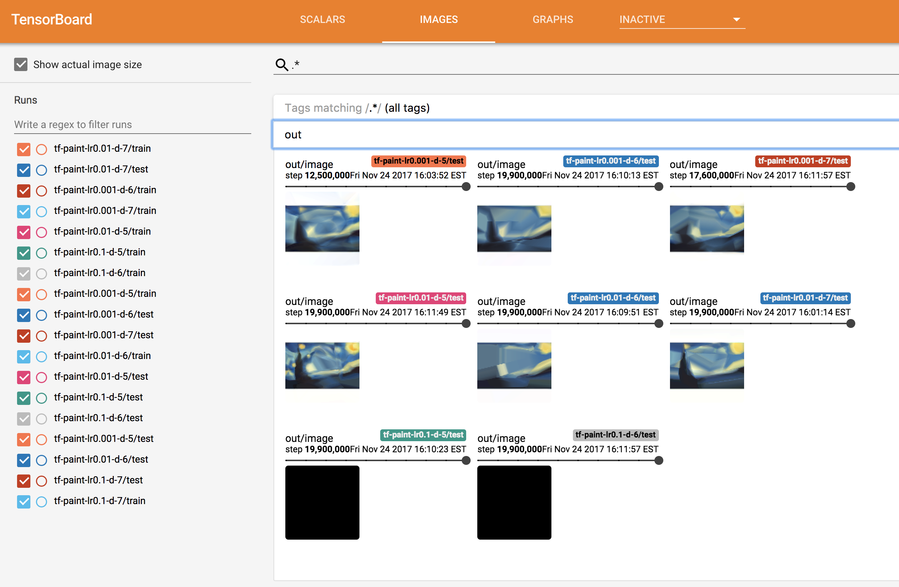

# Automated Hyperparameters Sweep with `TfJob` and Helm

## Prerequisites

* [3 - Helm](../3-helm)
* [5 - TfJob](../5-tfjob)
  
### "Vanilla" Hyperparameter Sweep

Just as distributed training, automated hyperparameter sweep is barely used in many organizations.
The reasons are similar: It takes a lot of resources, or time, to run more than a couple training for the same model.
  * Either you run different hypothesis in parallel, which will likely requires a lot of resources and VMs. These VMs need to be managed by someone, the model need to be deployed, logs and checkpoints have to be gathered etc.
  * Or you run everything sequentially on a few number of VMs, which takes a lot of time before being able to compare result

So in practice most people manually fine-tune their hyperparameters through a few runs and pick a winner.

### Kubernetes + Helm

Kubernetes coupled with Helm can make this easier as we will see. 
Because Kubernetes on Azure also allows you to scale very easily (manually or automatically), this allows you to explore a very large hyperparameter space, while maximizing the usage of your cluster (and thus optimizing cost).

In practice, this process is still rudimentary today as the technologies involved are all pretty young. Most likely tools better suited for doing hyperparameter sweeping in distributed systems will soon be available, but in the meantime Kubernetes and Helm already allow us to deploy a large number of trainings fairly easily.

### Why Helm?

As we saw in module [3 - Helm](../3-helm), Helm enables us to package an application in a chart and parametrize it's deployment easily.  
To do that, Helm allows us to use Golang templating engine in the chart definitions. This means we can use conditions, loops, variables and [much more](https://docs.helm.sh/chart_template_guide).  
This will allow us to create complex deployment flow.   

In the case of hyperparameters sweeping, we will want a chart able to deploy a number of `TfJobs` each trying different values for some hyperparameters.  
We will also want to deploy a single TensorBoard instance monitoring all these `TfJobs`, that way we can quickly compare all our hypothesis, and even early-stop jobs that clearly don't perform well if we want to reduce cost as much as possible.
For now, this chart will simply do a grid search, and while it is less efficient than random search it will be a good place to start.

## Exercise

### Creating and Deploying the Chart
In this exercise, you will create a new Helm chart that will deploy a number of `TfJobs` as well as a TensorBoard instance.

Here is what our `values.yaml` file could look like for example (you are free to go a different route):

```yaml
image: wbuchwalter/tf-paint:cpu
useGPU: false
shareName: tensorflow
hyperParamValues:
  learningRate:
    - 0.001
    - 0.01
    - 0.1
  hiddenLayers:
    - 5
    - 6
    - 7
```

That way, when installing the chart, 9 `TfJob` will actually get deployed, testing all the combination of learning rate and hidden layers depth that we specified.  
This is a very simple example (our model is also very simple), but hopefully you start to see the possibilities than Helm offers.

In this exercise, we are going to use a new model based on [Andrej Karpathy's Image painting demo](http://cs.stanford.edu/people/karpathy/convnetjs/demo/image_regression.html).  
This model objective is to to create a new picture as close as possible to the original one, "The Starry Night" by Vincent van Gogh:


The source code is located in [src/](./src/).  

Our model takes 3 parameters:

| argument | description | default value |
|------|-------------|---------------|
|`--learning-rate` | Learning rate value | `0.001` | 
|`--hidden-layers` | Number of hidden layers in our network. | `4` | 
|`--log-dir` | Path to save TensorFlow's summaries | `None`| 

For simplicity, docker images have already been created so you don't have to build and push yourself:
* `wbuchwalter/tf-paint:cpu` for CPU only.
* `wbuchwalter/tf-paint:gpu` for GPU.  

The goal of this exercise is to create an Helm chart that will allow us to test as many variations and combinations of the two hyperparameters `--learning-rate`and `--hidden-layers` as we want by just adding them in our `values.yaml` file.   
This chart should also deploy a single TensorBoard instance (and it's associated service), so we can quickly monitor and compare our different hypothesis.

If you are pretty new to Kubernetes and Helm and don't feel like building your own helm chart just yet, you can skip to the solution where details and explanations are provided.

#### Validation

Once you have created and deployed your chart, looking at the pods that were created, you should see a bunch of them, as well as a single TensorBoard instance monitoring all of them:

```console
kubectl get pods
```

```
NAME                                      READY     STATUS    RESTARTS   AGE
module7-tensorboard-3609490657-6w7zf             1/1       Running   0          23s
module7-tf-paint-0-0-master-tduk-0-zqngf     1/1       Running   0          2m
module7-tf-paint-0-1-master-ub9a-0-3rlbr     1/1       Running   0          2m
module7-tf-paint-0-2-master-ekw1-0-cp0l3     1/1       Running   0          2m
module7-tf-paint-1-0-master-jr7r-0-6jkwc     1/1       Running   0          2m
module7-tf-paint-1-1-master-rqh2-0-0t4zw     1/1       Running   0          2m
module7-tf-paint-1-2-master-le5b-0-34q38     1/1       Running   0          2m
module7-tf-paint-2-0-master-g7i9-0-jq1c1     1/1       Running   0          2m
module7-tf-paint-2-1-master-1urb-0-sq92z     1/1       Running   0          2m
module7-tf-paint-2-2-master-ay57-0-0qt2c     1/1       Running   0          2m
```

Looking at TensorBoard, you should see something similar to this:


> Note that TensorBoard can take a while before correctly displaying images.

Here we can see that some models are doing much better than others. Models with a learning rate of `0.1` for example are producing an all-black image, we are probably over-shooting.  
After a few minutes, we can see that the two best performing models are:
* 5 hidden layers and learning rate of `0.01`
* 7 hidden layers and learning rate of `0.001`

At this point we could decide to kill all the other models if we wanted to free some capacity in our cluster, or launch additional new experiments based on our initial findings.

#### Solution

Check out the commented solution chart: [./solution-chart/templates/deployment.yaml](./solution-chart/templates/deployment.yaml)

## Next Step

[8 - Going Further](../8-going-further)
