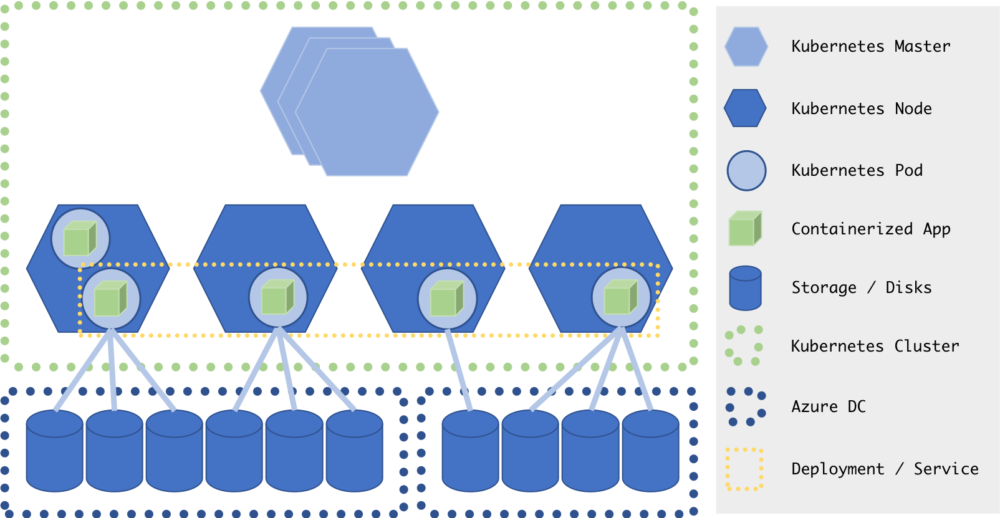

# Going Further

## Prerequisites

All the previous modules

## Summary

Here are some more advanced concepts and resources
  
## Distributed Storage, tools and concepts

Storage and statefull containers is a bit tricky in the containerization space.

Since in the most cases, you may have multiple containers running and reading or writing data you need to be able to centralize it somewhere and make it persisten. 

Plus, you may want different tiers such as high I/O stored on SSD or cheaper on cold storage. 

This concept is called distributed persistent storage. Kubernetes is handling it natively with Azure but you may want to use some standard, such as NFS for example, to be able to not be tight to your infrastructure or cloud provider.

*High level architecture overview*

Network File System (NFS) is a distributed file system protocol originally developed by Sun Microsystems in 1984,[1] allowing a user on a client computer to access files over a computer network much like local storage is accessed

Some tools and framework, implementing this standard, are becoming standard nowaday, we will try to talk about few of them.

### [GlusterFS](http://www.gluster.org/)

GlusterFS is a distributed, software-defined filesystem.
Storage devices, called “bricks”, are selected on one or more nodes to form logical storage volumes across a Gluster cluster.
- Runs on commodity hardware (even a Raspberry Pi!)
- Scale-out design: easy to increase storage by simply adding more nodes
- Provides features like cross-node and cross-site replication, usage balancing, and iSCSI storage access

### [Pachyderm](http://pachyderm.io/)

Pachyderm is a tool for production data pipelines. If you need to chain together data scraping, ingestion, cleaning, munging, wrangling, processing, modelling, and analysis in a sane way, then Pachyderm is for you. If you have an existing set of scripts which do this in an ad-hoc fashion and you're looking for a way to "productionize" them, Pachyderm can make this easy for you.

This is well integrated with docker and kubernetes to run balanced computing processing.

### [Azure-storage-fuse](https://github.com/Azure/azure-storage-fuse)

A virtual file system adapter for Azure Blob storage.

blobfuse is an open source project developed to provide a virtual filesystem backed by the Azure Blob storage. It uses the libfuse open source library to communicate with the Linux FUSE kernel module, and implements the filesystem operations using the Azure Storage Blob REST APIs.

### Autoscaling

[Autoscaling concepts with a Kubernetes cluster on Azure](https://medium.com/@wbuchwalter/autoscaling-a-kubernetes-cluster-created-with-acs-engine-on-azure-5e24ddc6402e)